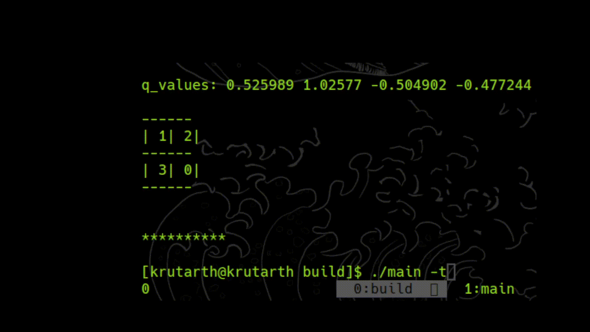

# Deep Q-Learning for the $N^2-1$ puzzle from scratch

This code implements Deep Reinforcement Learning with Double Q-Learning. It uses two neural networks, the actor network and the target network.

## Demo

To demonstrate the network, I will use the $2\times2$ puzzle. Partly because it takes less time to train and partly because higher values of $N$ are much too difficult to train without leverging a GPU.

For the demo, 

following architecture was used:


following hyperparameters were used:

- INITIAL_LEARNING_RATE=0.0009
- GRAD_DECAY=0.99
- BATCH_SIZE=30
- REPLAY_SIZE=1000000
- GAMMA=0.7 
- UPDATE_COUNT=50
- STEPS_PER_EPISODE=10000
- OUT_OF_BOUNDS=-0.5
- COMPLETION_REWARD=1.0	
- OPTIMIZER=RMSProp

Leaky ReLU was used as the activation function for the two hidden layers and Linear activation was used for the output layer.

the model was trained on 1000 episodes or epochs ( I have used them interchangeably in the code ). Since the number of states are just 12, we can test the model effectively on all states.

here is one testcase, the model trains and then plays one starting state:


## Install

1) Clone the repo by:
```
git clone git@github.com:kuku929/math_puzzle_rl.git <your-project-name>
cd <your-project-name>/RL_DQN
```
2) Make a build directory and create a build file. You can use any build system of your choice, I have used ninja:
```
mkdir build | cd build
cmake .. -G Ninja
```
3) Build the project:
```
ninja
```
you should see an executable named main in the build directory. 

## Usage

Here is brief description of all the sub-directories :
- *src* : contains .cpp files, the definition of all the functions
- *include* : contains .h files, the declaration of all the functions
- *data* : contains the script to create training data
    - *training_set.cpp* : code to create training data. For more help on running the program, do:
        ```
        g++ training_set.cpp -o train
        ./train -h
        ```
    - *input.txt* : the text file to input the starting state for the model to play, a demo input.txt file is provided, make sure to input in the same manner.
- main.cpp : contains main() function.
- build : build files to compile and execute the program.
    - *main* : executable. the following flags can be used : 
        - w : copies weights from *weights.txt* file and plays the puzzle( starting state must be in *input.txt* )
        ``` 
        ./main -w
        ```
        - t : trains the model starting from randomised weights and plays the puzzle. Saves the final weights in *weights.txt*
        ```
        ./main -t
        ```
        you can checkpoint your training and resume whenever required using: 
        ```
        ./main -w -t
        ```
the hyperparameters for the neural network are stored in /src/globals.cpp
