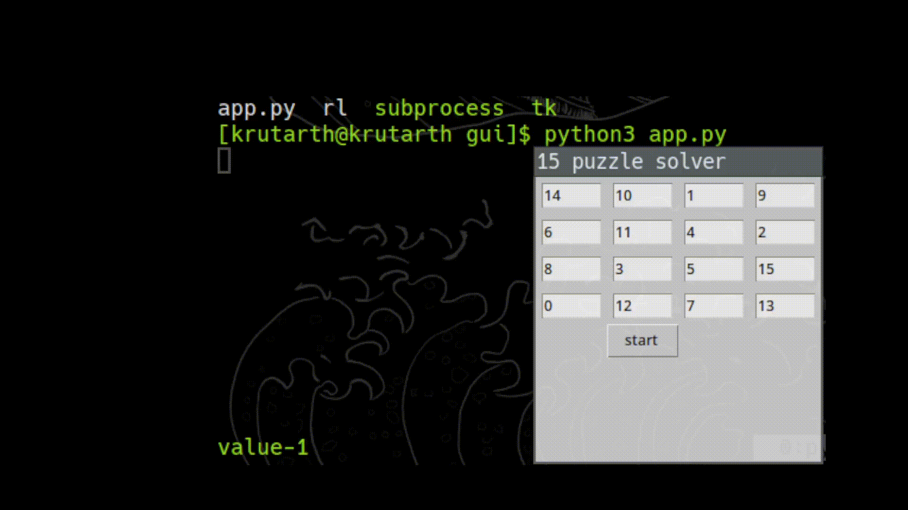

# Value Iteration for solving the 15-puzzle

## Demo

There is a simple gui to input the starting state, the moves done by the model are displayed in the terminal

Here is a demo for a random state:



## Install 

1) Clone the repo by:
```
git clone git@github.com:kuku929/math_puzzle_rl.git <your-project-name>
cd <your-project-name>/RL_ValueIter
```
2) Make a build directory and create a build file. You can use any build system of your choice, I have used ninja:
```
mkdir build | cd build
cmake .. -G Ninja
```
3) Build the project:
```
ninja
```
you should see an executable named rl in the build directory. 

## Usage

There are 3 flags supported to run the program. There is a gui to input starting states.

- p : Pass this flag if you already have a policy and want to start with that policy as the initial guess. The policy must be in build/policy.txt, the values for which should be in build/values.txt .

- t : Pass this flag if you want to train the model.

- i : Pass this flag if you want the model to play a starting state, the flag should be followed by the path to the input. It is preferred however that you use the gui to input the starting state. 

Train the model from scratch:
```
./rl -t
```
Train the model starting from a prexisting policy:
```
./rl -p -t
```
Use a prexisting policy to play the puzzle:
```
./rl -p -i [filename]
```

To run the gui:

1) Inside the gui directory, run the following command 
    ```
    python3 app.py
    ```

2) Enter the input state and start the solver.

